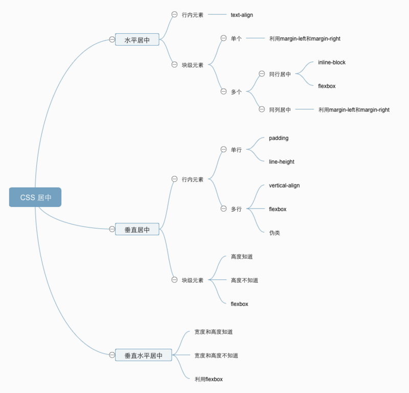

# 你所不知道的 CSS 居中

## 前言

> 这次翻译一篇来自 Chris Coyier 的 《Centering in CSS: A Complete Guide》

`居中`是在`CSS`中经常被抱怨的问题之一。这个问题真的有这么难吗？事实上这个问题并`没有那么复杂`，它`困难`在于对于`不同的情景`，`解决`居中问题需要用到`不一样`的方法。

在这里，我们会一起建立`思维导图`来帮助大家来`解决`这个问题。
##### github 地址 [传送门](https://github.com/zhangxiangliang/you-dont-know-css-center)

## 脑图



## 水平居中
### 行内元素
##### `display`属性为`inline` 或者 `inline-*` 行内元素?（例如：文本或者链接）
如果你需要居中的`行内元素`在`块级元素`中，你可以使用下面方法。
```
.center-children {
	text-align: center;
}
```
##### 例子：[传送门](https://github.com/zhangxiangliang/you-dont-know-css-center/blob/master/horizontally/01-inline-within-block.html)

### 单个 - 块级元素
##### 如果需要使得`块级元素居中`，可以利用`margin-left`和`margin-right`。
```
.center-me {
	margin: 0 auto;
}
```
##### 例子：[传送门](https://github.com/zhangxiangliang/you-dont-know-css-center/blob/master/horizontally/02-block.html)
##### 注意：不能是一个浮动的块级元素哦~

### 多个 - 块级元素 - 同行居中
##### 如果需要使得`多个块级元素居中`，这个时候用 `magin`可就不行啦，但是我们可以使用`inline-block`或者`flexbox`来实现居中。
##### inline-block
利用`行内元素`在`块级元素`中的居中方法，先让`内部`的`块级元素`变为行内元素，再对`父级`的`块级元素`使用居中。
```
.center-parent {
	text-align: center;
}
.center-parent .center-child{
	display: inline-block;
}
```
##### flexbox
```
.center-parent {
	display: flex;
	justify-content: center;
}
```
##### 例子：[传送门](https://github.com/zhangxiangliang/you-dont-know-css-center/blob/master/horizontally/03-more-block.html)

### 多个 - 块级元素 - 同列居中
#####利用`单个块级元素`的`居中`方法,来实现`多个块级元素`的`垂直居中`。
```
.center-me {
	margin: 0 auto;
}
```
##### 例子：[传送门](https://github.com/zhangxiangliang/you-dont-know-css-center/blob/master/horizontally/04-more-block-row.html)

## 垂直居中
### 单行 - 行内元素 
##### `display`属性为`inline` 或者 `inline-*` 行内元素?（例如：文本或者链接）。可以利用`padding`或者`line-height`来实现。
##### padding
```
.text {
	padding-top: 30px;
	padding-bottom: 30px;
}
```
##### 例子：[传送门](https://github.com/zhangxiangliang/you-dont-know-css-center/blob/master/vertically/01-single-inline.html)
#####  line-height （值和`height`一样）
```
.text {
	height: 100px;
	line-height: 100px;
}
```
##### 例子：[传送门](https://github.com/zhangxiangliang/you-dont-know-css-center/blob/master/vertically/02-sigle-inline-height-line.html)

### 多行 - 行内元素
##### 对于多行`行内元素`，如果使用`单行`的方法，在换行之后，会出现错误。这个时候可以利用`表格`的`vertical-align`或者`flexbox`或者`伪类`来实现。
##### vertical-align
```
.center-table {
	display: table;
}
.center-table p {
	display: table-cell;
	vertical-align: middle;
}
```
##### 例子：[传送门](https://github.com/zhangxiangliang/you-dont-know-css-center/blob/master/vertically/03-multiple-inline-table.html)
##### flexbox
```
.center-flexbox {
	display: flex;
	justify-content: center;
	flex-direction: column;
}
```
##### 例子：[传送门](https://github.com/zhangxiangliang/you-dont-know-css-center/blob/master/vertically/04-multiple-inline-flex.html)
##### 伪类
```
.center-parent {
	position: relative;
}
.center-parent::before {
	content: "";
	display: inline-block;
	height: 100%;
	width: 1%;
	vertical-align: middle;
}
.center-parent p {
	display: inline-block;
	vertical-align: middle;
}
```
##### 例子：[传送门](https://github.com/zhangxiangliang/you-dont-know-css-center/blob/master/vertically/05-multiple-inline-ghost.html)

### 块级元素
##### 元素高度知道
```
.parent {
	position: relative;
}
.child {
	position: absolute;
	top: 50%;
	height: 100px;
	margin-top: -50px; // 高度的一半
}
```
##### 例子：[传送门](https://github.com/zhangxiangliang/you-dont-know-css-center/blob/master/vertically/06-block-know-height.html)
##### 元素高度不知道
```
.parent {
	position: relative;
}
.child {
	position: absolute;
	top: 50%;
	transform: translateY(-50%);
}
```
##### 例子：[传送门](https://github.com/zhangxiangliang/you-dont-know-css-center/blob/master/vertically/07-block-dont-know-height.html)
##### flexbox
```
.parent {
	display: flex;
	flex-direction: column;
	justify-content: center;
}
```
##### 例子：[传送门](https://github.com/zhangxiangliang/you-dont-know-css-center/blob/master/vertically/08-block-flexbox.html)

## 垂直水平居中
##### 宽度和高度知道(利用`垂直居中`的`块级元素`高度知道)
```
.parent {
  position: relative;
}

.child {
  width: 200px;
  height: 100px;

  position: absolute;
  top: 50%;
  left: 50%;

  margin: -50px 0 0 -100px;
}
```
##### 例子：[传送门](https://github.com/zhangxiangliang/you-dont-know-css-center/blob/master/both/01-know-element-height.html)
##### 宽度和高度不知道(利用`垂直居中`的`块级元素`高度不知道)
```
.parent {
  position: relative;
}
.child {
  position: absolute;
  top: 50%;
  left: 50%;
  transform: translate(-50%, -50%);
}
```
##### 例子：[传送门](https://github.com/zhangxiangliang/you-dont-know-css-center/blob/master/both/02-dont-know-element-height.html)
##### flexbox
```
.parent {
  display: flex;
  justify-content: center;
  align-items: center;
}
```
##### 例子：[传送门](https://github.com/zhangxiangliang/you-dont-know-css-center/blob/master/both/03-use-flexbox.html)

## 一起成长

> 在困惑的城市里总少不了并肩同行的 `伙伴` 让我们一起成长。

* 如果您想让更多人看到文章可以点个 `点赞`。
* 如果您想激励小二可以到 [Github](https://github.com/zhangxiangliang/you-dont-know-css-center) 给个 `小星星`。

> 本文原稿来自 [ZhangXiangLiang](https://github.com/zhangxiangliang)
